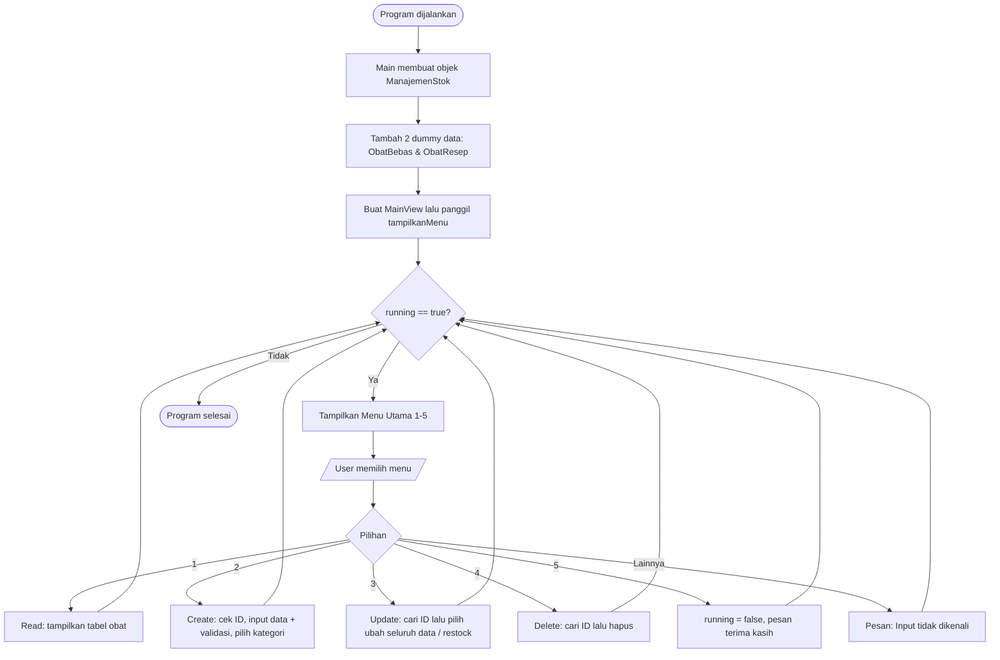

# Mini Project 3 PBO - Manajemen Stok Obat pada Apotek

Program **Sistem Manajemen Stok Obat pada Apotek** berbasis Java (CLI/console) yang dibuat untuk **Mini Project 3 – Pemrograman Berorientasi Objek (PBO)**. Program ini merupakan lanjutan dari Mini Project 2 dengan tambahan penerapan **abstraction** (abstract class & abstract method), penyempurnaan **polymorphism**, dan **interface** sebagai nilai tambah.

* **Nama:** Muhammad Ihsan Kamil
* **NIM:** 2509116035
* **Praktikum:** Pemrograman Berorientasi Objek (PBO)

---

## 1. Deskripsi Singkat Program

**Sistem Manajemen Stok Obat Apotek** adalah aplikasi console untuk membantu apotek mencatat dan mengelola data obat. Program menyediakan fitur **CRUD** (Create, Read, Update, Delete):

| Menu | Fitur | Keterangan |
|------|-------|------------|
| 1 | Tampilkan Semua Obat | **Read** – menampilkan seluruh data obat dalam bentuk tabel |
| 2 | Tambah Obat Baru | **Create** – menambah obat baru (Obat Bebas / Obat Keras) |
| 3 | Ubah Data Obat | **Update** – mengubah seluruh data (nama, stok, harga) **atau** hanya menambah stok (restock) berdasarkan ID |
| 4 | Hapus Obat | **Delete** – menghapus obat berdasarkan ID |
| 5 | Keluar | Mengakhiri program |

Obat dibagi menjadi dua jenis:

* **Obat Bebas** → dapat dibeli tanpa resep, menyimpan informasi **efek samping**.
* **Obat Keras (Obat Resep)** → harus dengan resep dokter, menyimpan informasi **nama dokter**.

Data disimpan sementara di dalam `ArrayList<Obat>`, sehingga data akan kembali ke data dummy awal setiap program dijalankan ulang.

### Perubahan dari Mini Project 2

| Aspek | Mini Project 2 | Mini Project 3 |
|-------|----------------|----------------|
| Abstraction | Belum ada | `Obat` menjadi **abstract class** dengan **abstract method** `getKategoriString()` |
| Interface | Belum ada | Ditambahkan interface `InfoObat` (nilai tambah) |
| Overloading | `tambahObat()` | `updateObat()` (versi ubah seluruh data dan versi restock) |
| Kategori obat | Class `KategoriObat` terpisah | Ditentukan oleh masing-masing subclass lewat `getKategoriString()` |
| Validasi input | Method di class `Main` | Dipisah ke class `ValidasiInput` (package `Utils`) |
| View | Digabung di `Main` | `MainView` (tampilan) dipisah dari `Main` (titik masuk program) |
| Cek ID | Tidak ada | ID duplikat ditolak saat menambah obat |

---

## 2. Penjelasan Struktur Package

Program dipisah ke dalam package sesuai pola **MVC (Model – View – Controller)**, ditambah package `Main` sebagai titik masuk program dan `Utils` sebagai kelas bantu.

```
Minpro-3-PBO-ManajemenStokObatApotek/
└── src/
    ├── Main/
    │   └── Main.java
    ├── Model/
    │   ├── InfoObat.java
    │   ├── Obat.java
    │   ├── ObatBebas.java
    │   └── ObatResep.java
    ├── Controller/
    │   └── ManajemenStok.java
    ├── View/
    │   └── MainView.java
    └── Utils/
        └── ValidasiInput.java
```

| Package | File | Peran |
|---------|------|-------|
| `Main` | `Main.java` | Titik masuk program: membuat controller, mengisi dummy data, lalu menjalankan view |
| `Model` | `InfoObat.java` | **Interface** – kontrak `tampilkanInfo()` (nilai tambah) |
| `Model` | `Obat.java` | **Abstract class / superclass** – atribut & perilaku umum semua obat, mengimplementasikan `InfoObat` |
| `Model` | `ObatBebas.java` | **Subclass** dari `Obat` – menambah atribut `efekSamping` |
| `Model` | `ObatResep.java` | **Subclass** dari `Obat` – menambah atribut `namaDokter` |
| `Controller` | `ManajemenStok.java` | Logika pengelolaan data: menyimpan `ArrayList<Obat>` dan operasi CRUD |
| `View` | `MainView.java` | Antarmuka pengguna: menu, membaca input keyboard, menampilkan tabel dan pesan |
| `Utils` | `ValidasiInput.java` | Kelas bantu untuk validasi input angka (dipanggil oleh View) |

**Alasan pemisahan:**

* **Model** berisi data obat beserta aturan datanya (atribut, getter/setter, dan format tampilan satu baris data).
* **Controller** berisi logika pengelolaan data (tambah, cari, ubah, hapus) dan tidak berinteraksi dengan `Scanner`.
* **View** mengurus tampilan menu dan pengambilan input, lalu meneruskannya ke Controller.
* **Utils** memisahkan logika validasi.

---

## 3. Penjelasan Alur Program

### 3.1 Diagram Alur



### 3.2 Penjelasan Alur Langkah demi Langkah

#### Program Dijalankan (Run)

1. Method `main()` di `Main/Main.java` dieksekusi.
2. Dibuat objek `ManajemenStok app` (Controller) yang di dalamnya sudah ada `ArrayList<Obat>` kosong.
3. **Dummy data awal** dimasukkan lewat `app.tambahObat(...)`:
   - `OBT01` – Paracetamol – stok 50 – Rp 5.000 – Obat Bebas – efek samping "Mengantuk"
   - `OBT02` – Amoxicillin – stok 20 – Rp 12.000 – Obat Keras – dokter "dr. Rizki"
4. Dibuat objek `MainView view` dengan mengirim `app` ke constructor, lalu `view.tampilkanMenu()` dipanggil.
5. Variabel `running = true` dan program masuk ke perulangan `while (running)`.

**Screenshot: Program pertama kali dijalankan**


---

#### Menu Utama

Setiap iterasi perulangan menampilkan:

```
=== SISTEM MANAJEMEN STOK OBAT APOTEK ===
1. Tampilkan Semua Obat (Read)
2. Tambah Obat Baru (Create)
3. Ubah Data Obat (Update)
4. Hapus Obat (Delete)
5. Keluar
Pilih menu (1-5):
```

Input dibaca dengan `scanner.nextLine().trim()` lalu diproses menggunakan `switch`. Jika input bukan `1`–`5`, masuk ke `default` dan muncul pesan **"Input tidak dikenali! Harap masukkan angka 1-5."** lalu menu ditampilkan kembali.

**Screenshot: Input menu tidak valid**


---

#### Menu 1: Tampilkan Semua Obat (Read)

1. `tampilkanTabelObat()` di `MainView` dipanggil dan mengambil data dari `app.getSemuaObat()`.
2. Jika list kosong → tampil pesan **"Stok obat masih kosong."**
3. Jika ada data → dicetak header tabel (ID, Nama Obat, Kategori, Stok, Harga, Keterangan Khusus).
4. Perulangan `for` memanggil `o.tampilkanInfo()` untuk setiap obat. Karena **polymorphism**, obat bebas menampilkan `Efek: ...` sedangkan obat resep menampilkan `Dokter: ...`.

**Screenshot: Tampilan data dummy**


**Screenshot: Menu 1 saat data kosong (setelah semua data dihapus)**


---

#### Menu 2: Tambah Obat Baru (Create)

Urutan input:

1. **ID Obat** (teks) → jika ID sudah terdaftar (tidak membedakan huruf besar/kecil), muncul pesan **"ID Obat sudah terdaftar! Gunakan menu update."** dan proses dibatalkan.
2. **Nama Obat** (teks)
3. **Jumlah Stok** → divalidasi oleh `ValidasiInput.inputIntPositif()` (harus bilangan bulat dan tidak negatif)
4. **Harga Obat** → divalidasi oleh `ValidasiInput.inputDoublePositif()` (harus angka dan tidak negatif)
5. **Kategori Obat** (dipilih dengan `switch`):
   - `1` → Obat Bebas → lanjut input **Efek Samping** → objek `ObatBebas` dibuat
   - `2` → Obat Keras → lanjut input **Nama Dokter** → objek `ObatResep` dibuat
   - Selain itu → pesan **"Kategori tidak valid! Batal menambahkan data."** dan data tidak disimpan
6. Objek baru dimasukkan ke `ArrayList` lewat `app.tambahObat(...)`, lalu tampil pesan berhasil.

**Screenshot: Tambah obat Bebas (Kategori 1)**


**Screenshot: Tambah obat Keras (Kategori 2)**


**Screenshot: ID obat sudah terdaftar**


**Screenshot: Validasi input salah (huruf / angka negatif pada Stok)**


**Screenshot: Validasi input salah (huruf / angka negatif pada Harga)**


**Screenshot: Kategori tidak valid**


---

#### Menu 3: Ubah Data Obat (Update)

1. User memasukkan **ID Obat** yang ingin diubah.
2. Program mencari dengan `cariObatById()` (tidak membedakan huruf besar/kecil karena memakai `equalsIgnoreCase`). Jika tidak ditemukan, tampil **"Gagal Update! ID Obat tidak ditemukan."**
3. Jika ditemukan, user memilih jenis update:
   - `1` **Ubah Seluruh Data** → input Nama Baru, Stok Baru, Harga Baru → memanggil `updateObat(id, nama, stok, harga)` (**overloading versi 1**, 4 parameter).
   - `2` **Tambah Stok Saja (Restock)** → input jumlah stok tambahan → memanggil `updateObat(id, tambahanStok)` (**overloading versi 2**, 2 parameter).
   - Selain itu → pesan **"Opsi tidak valid! Batal mengubah data."**
4. Perubahan dilakukan lewat setter (`setNamaObat()`, `setStok()`, `setHarga()`) pada objek obat.

**Screenshot: Ubah seluruh data**


**Screenshot: Restock (tambah stok)**


**Screenshot: Update dengan ID yang tidak ditemukan**


---

#### Menu 4: Hapus Obat (Delete)

1. User memasukkan **ID Obat** yang ingin dihapus.
2. `app.hapusObat(id)` mencari obat, lalu menghapusnya dari `ArrayList`.
3. Jika berhasil tampil **"Obat berhasil dihapus!"**, jika tidak ada tampil **"Gagal Hapus! ID Obat tidak ditemukan."**

**Screenshot: Hapus obat berhasil**


**Screenshot: Hapus dengan ID tidak ditemukan**


---

#### Menu 5: Keluar

1. Variabel `running` diubah menjadi `false`.
2. Tampil pesan **"Terima kasih!"**
3. Perulangan `while` berhenti dan program selesai.

**Screenshot: Keluar dari program**


---

## 4. Penjelasan Penerapan Encapsulation dan Inheritance

### 4.1 Encapsulation (Access Modifier, Getter dan Setter)

Seluruh atribut dibuat `private` sehingga tidak bisa diakses langsung dari luar class, dan hanya bisa diakses lewat method `public`.

| Class | Atribut Private | Getter | Setter |
|-------|-----------------|--------|--------|
| `Obat` | `idObat` (`final`) | `getIdObat()` | – (ID tidak boleh diubah setelah dibuat) |
| `Obat` | `namaObat` | `getNamaObat()` | `setNamaObat()` |
| `Obat` | `stok` | `getStok()` | `setStok()` |
| `Obat` | `harga` | `getHarga()` | `setHarga()` |
| `ObatBebas` | `efekSamping` | – | – (hanya dipakai di dalam class itu sendiri) |
| `ObatResep` | `namaDokter` | – | – (hanya dipakai di dalam class itu sendiri) |
| `ManajemenStok` | `daftarObat` | `getSemuaObat()` | – |
| `MainView` | `app`, `scanner` (`final`) | – | – |

| Modifier | Penerapan | Contoh |
|----------|-----------|--------|
| `private` | Semua atribut | `private int stok;`, `private ArrayList<Obat> daftarObat;` |
| `private final` | Atribut yang referensinya tidak boleh diganti | `private final String idObat;`, `private final Scanner scanner;` |
| `public` | Class, constructor, dan method yang perlu diakses class lain | `public abstract class Obat`, `public boolean hapusObat()`, getter & setter |

**Poin penting:** `ManajemenStok` mengubah data obat lewat setter (`o.setNamaObat()`, `o.setStok()`, `o.setHarga()`), bukan mengakses atribut langsung.

### 4.2 Inheritance

Program memiliki **1 superclass (abstract)** dan **2 subclass**:

```
            ┌──────────────────────────┐
            │  Obat (abstract class)   │
            │  idObat, namaObat,       │
            │  stok, harga             │
            └────────────┬─────────────┘
          extends        │        extends
      ┌──────────────────┴──────────────────┐
┌─────▼───────────┐                 ┌───────▼─────────┐
│ ObatBebas       │                 │ ObatResep       │
│ + efekSamping   │                 │ + namaDokter    │
└─────────────────┘                 └─────────────────┘
```

| Class | Peran | Atribut Tambahan | Lokasi |
|-------|-------|------------------|--------|
| `Obat` | Superclass (abstract) | – | `Model/Obat.java` |
| `ObatBebas` | Subclass 1 (`extends Obat`) | `efekSamping` | `Model/ObatBebas.java` |
| `ObatResep` | Subclass 2 (`extends Obat`) | `namaDokter` | `Model/ObatResep.java` |

Kedua subclass memakai `super(...)` di constructor untuk memanggil constructor `Obat`, sehingga atribut umum (ID, nama, stok, harga) tidak perlu ditulis ulang. Subclass hanya menambahkan atribut khususnya.

---

## 5. Penjelasan Penerapan Polymorphism dan Abstraction

### 5.1 Abstraction

Abstraction diterapkan dengan **abstract class** dan **abstract method** pada class `Obat` (`Model/Obat.java`).

| Elemen | Lokasi | Penjelasan |
|--------|--------|------------|
| Abstract class | `public abstract class Obat` | Menjadi kerangka umum semua obat. Class ini **tidak bisa diinstansiasi** (`new Obat(...)` akan error), karena "obat" secara umum tidak cukup spesifik; harus berupa obat bebas atau obat keras. |
| Abstract method | `public abstract String getKategoriString();` | Hanya berisi deklarasi tanpa isi. Setiap subclass **wajib** mengimplementasikannya. |
| Implementasi `ObatBebas` | `Model/ObatBebas.java` | `getKategoriString()` mengembalikan `"Obat Bebas"` |
| Implementasi `ObatResep` | `Model/ObatResep.java` | `getKategoriString()` mengembalikan `"Obat Keras"` |

`Obat.tampilkanInfo()` memanggil `getKategoriString()` tanpa perlu tahu jenis obatnya; detail kategori diserahkan ke subclass.

### 5.2 Polymorphism

#### a. Method Overriding

| Method | Didefinisikan di | Di-override di | Hasil |
|--------|------------------|----------------|-------|
| `tampilkanInfo()` | `Obat` (kolom umum: ID, nama, kategori, stok, harga) | `ObatBebas` | Kolom umum + `Efek: <efekSamping>` |
| `tampilkanInfo()` | `Obat` | `ObatResep` | Kolom umum + `Dokter: <namaDokter>` |
| `getKategoriString()` | `Obat` (abstract) | `ObatBebas`, `ObatResep` | `"Obat Bebas"` / `"Obat Keras"` |

Setiap override memakai anotasi `@Override`, dan `tampilkanInfo()` pada subclass memanggil `super.tampilkanInfo()` terlebih dahulu lalu menambahkan kolom khususnya.

Pada `MainView.tampilkanTabelObat()`, list bertipe `ArrayList<Obat>` berisi objek `ObatBebas` dan `ObatResep`. Saat `o.tampilkanInfo()` dipanggil, Java menjalankan versi milik objek yang sebenarnya (*dynamic method dispatch*), sehingga satu perulangan `for` cukup untuk menampilkan dua jenis obat dengan format berbeda.

#### b. Method Overloading

Method `updateObat()` di `Controller/ManajemenStok.java` memiliki dua versi dengan parameter berbeda:

| Versi | Signature | Fungsi |
|-------|-----------|--------|
| 1 | `updateObat(String id, String namaBaru, int stokBaru, double hargaBaru)` | Mengubah **seluruh** informasi obat (nama, stok, harga) |
| 2 | `updateObat(String id, int tambahanStok)` | Hanya **menambah stok** obat (restock) |

Keduanya dipanggil dari `MainView` pada menu 3, dan Java menentukan versi mana yang dipakai berdasarkan jumlah dan tipe argumen.

---

## 6. Letak Penerapan Nilai Tambah

> Nilai tambah yang diterapkan: **Interface**.

| Elemen | Lokasi | Penjelasan |
|--------|--------|------------|
| Deklarasi interface | `Model/InfoObat.java` | `public interface InfoObat { void tampilkanInfo(); }` – kontrak bahwa class yang mengimplementasikannya harus bisa menampilkan informasinya. |
| Implementasi interface | `Model/Obat.java` | `public abstract class Obat implements InfoObat` – `Obat` menyediakan implementasi `tampilkanInfo()` dengan `@Override`. |
| Pewarisan ke subclass | `ObatBebas`, `ObatResep` | Karena `Obat` mengimplementasikan `InfoObat`, kedua subclass otomatis juga bertipe `InfoObat` dan meng-override `tampilkanInfo()` sesuai kebutuhannya. |

Dengan adanya interface, kontrak "dapat menampilkan informasi" terpisah dari pewarisan data (`Obat`). Jika nanti ada class lain yang tidak turunan `Obat` (misalnya `Supplier`) yang perlu menampilkan informasi, class tersebut cukup mengimplementasikan `InfoObat`.

---

## 7. Validasi Input

| Bentuk Validasi | Lokasi | Penjelasan |
|-----------------|--------|------------|
| Angka bulat & tidak negatif | `Utils/ValidasiInput.java` → `inputIntPositif()` | Memakai `Integer.parseInt()` dalam `while(true)` dengan `try-catch`. Huruf menampilkan **"Input salah! Masukkan angka bulat yang valid."**, nilai negatif menampilkan **"Input salah! Nilai stok tidak boleh negatif."**, lalu input diulang. Dipakai untuk **stok**. |
| Angka desimal & tidak negatif | `Utils/ValidasiInput.java` → `inputDoublePositif()` | Memakai `Double.parseDouble()` dengan pola yang sama. Dipakai untuk **harga**. |
| Validasi menu | `View/MainView.java` → `switch` `default` | Pilihan selain 1–5 ditolak dengan pesan. |
| Validasi kategori & opsi update | `View/MainView.java` | Pilihan selain 1/2 membatalkan proses dengan pesan. |
| ID duplikat | `View/MainView.java` (menu 2) → `cariObatById()` | ID yang sudah terdaftar ditolak. |
| ID tidak ditemukan | `Controller/ManajemenStok.java` → `updateObat()` & `hapusObat()` | Mengembalikan `false` jika ID tidak ada, lalu View menampilkan pesan gagal. |
| Data kosong | `View/MainView.java` → `tampilkanTabelObat()` | Jika list kosong, tampil **"Stok obat masih kosong."** |
| Pembersihan spasi | `View/MainView.java`, `ValidasiInput.java` | Semua input teks memakai `.trim()`. |

---

## 8. Dummy Data Awal

Dummy data dimasukkan di `main()` (`Main/Main.java`) **sebelum menu ditampilkan**, sehingga menu 1 langsung menampilkan data tanpa input manual.

| ID | Nama | Jenis | Stok | Harga | Keterangan |
|----|------|-------|------|-------|------------|
| OBT01 | Paracetamol | ObatBebas | 50 | Rp 5.000 | Efek: Mengantuk |
| OBT02 | Amoxicillin | ObatResep | 20 | Rp 12.000 | Dokter: dr. Rizki |

---

## 9. Cara Menjalankan

1. Pastikan JDK sudah terpasang (`java -version`).
2. Clone repository ini.
3. Dari folder `src`, kompilasi seluruh file lalu jalankan class `Main`:

```bash
javac Main/Main.java Model/*.java Controller/*.java View/*.java Utils/*.java
java Main.Main
```

---

<p align="center">Dibuat oleh <b>Muhammad Ihsan Kamil</b> – Pemrograman Berorientasi Objek</p>
